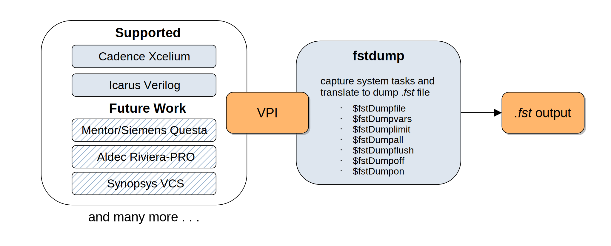

<a href="https://github.com/semify-eda/fstdumper/releases/latest">

</a>

# fstdumper
Verilog VPI module to dump FST (Fast Signal Trace) databases




> FST: Fast Signal Trace. This format is a block-based variant of IDX which is designed for very fast sequential and random access. FST has been designed to handle extremely large designs efficiently.

# Overview

The aim of this project is to provide a unified VPI module working on most simulators that provide extensive VPI support to dump waveforms in the `.fst` format. The resulting `.fst` file can than be opened and viewed using the [GTKWave](http://gtkwave.sourceforge.net/) waveform viewer.

But why? Proprietary simulators usually bring with them their own proprietary waveform formats. While VCD (Value Change Dump) is supported by if not all simulators, it is not very efficient in terms of space and performance. That's where `fstdumper` comes in: the idea is to reduce reliance on proprietary waveform formats by providing the ability to use an open, efficient format such as FST.

For the dumper itself the excellent implementation from [Icarus Verilog](https://github.com/steveicarus/iverilog) has been adapted to work on other simulators too. Some iverilog specific features therefore had to be removed.

## Simulator specific bits

Some simulators support more of the VPI standard than others. This means that certain features of the dumper which rely on VPI constructs that aren't supported on all target simulators need to be disabled.

There is the possibility to enable simulator specific features by using defines:

Config file `/src/include/config.h`

```
#define ICARUS_VERILOG
```

# Example usage

```
module top;

logic clk;

initial
  begin
    $display("fstdumper!");
    clk = 1;
    
    $fstDumpfile("top.fst");
    $fstDumpvars(0, top);
    $fstDumplimit(1000);
    
    # 5 $fstDumpall;
    # 5 $fstDumpflush;
    # 5 $fstDumpoff;
    # 5 $fstDumpon;
    # 5 $finish;
  end

always #1 clk = ~clk;

endmodule
```

# Compiling

Compiling the `fstdumper` shared library is as easy as issuing:

```
make fstdumper.so
```

## Example Simulation

An example for the **Icarus Verilog** simulator can be run with:

```
make simulation-iverilog
```

An example for the **Cadence Xcelium** simulator can be run with:

```
make simulation-xrun
```

# Compatibility Matrix


| Simulator       | Version               | Status |
|-----------------|-----------------------|--------|
| Icarus Verilog  | Version 11.0 (stable) | works  |
| Cadence Xcelium | 19.09-s001            | works  |
|                 |                       |        |

You too can contribute by testing `fstdumper` on other simulators or other versions of these simulators. Any help is very much appreciated!

# Contributing

Contributing in this projects follows the usual guidelines:

- Fork the repository
- Make your changes
- Submit a Pull Request
- After your Pull Request is accepted it will be merged

Before you make your changes, check to see if an issue exists already for the change you want to make. If not create one. We'll use the issue to have a conversation about the new feature you want to add or the problem you want to fix.

The versioning of the library follows the [Semantic Versioning](https://semver.org/) Specification.